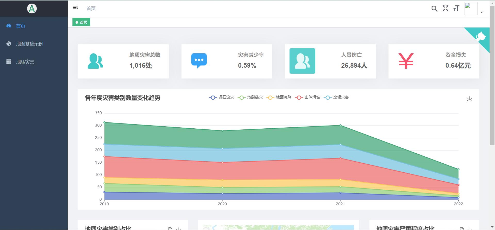

# 全国地质灾害信息管理系统

## 系统简介

该系统为前后端分离系统，前端使用Vue2，后端使用node.js。该系统[组件库](https://github.com/DuanYanYu/ArcGIS-Vue)作为测试系统。

## 前端启动

1. 进入front文件夹，下载相关包

```
npm i
```

2. 启动

```
npm run dev
```

## 后端启动

1. 进入backend文件夹，下载相关包

```
npm i
```

2. 启动

```
nodemon app.js
```

